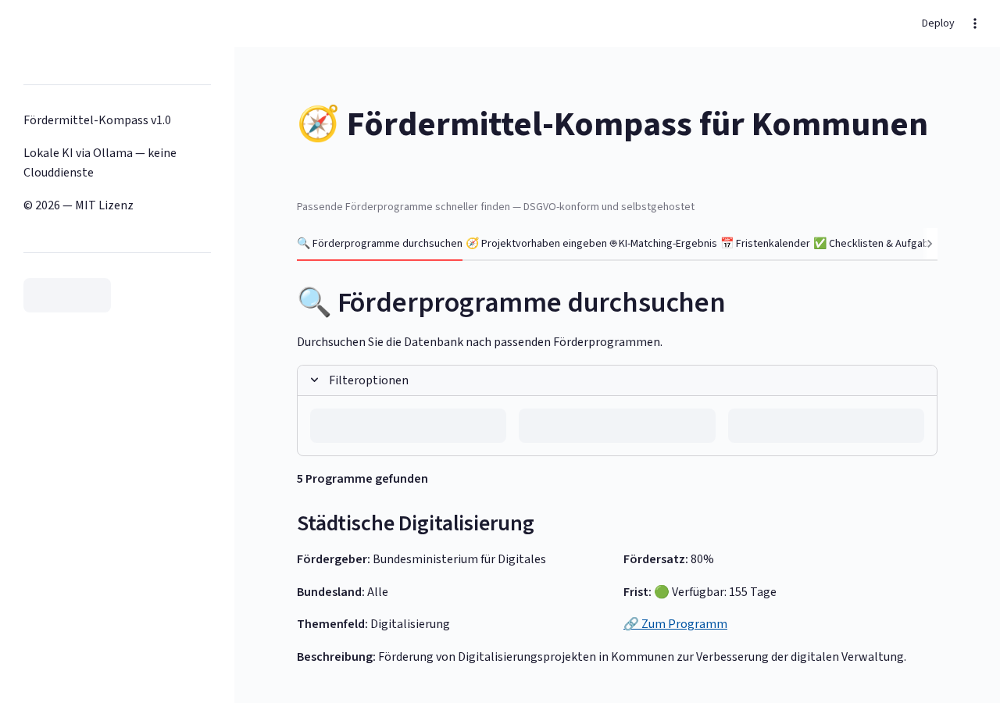
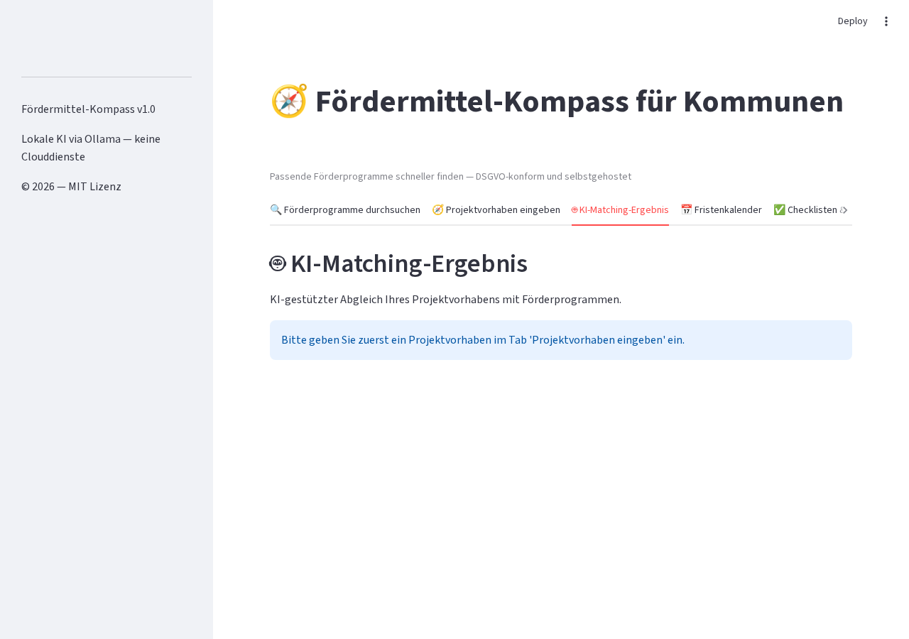
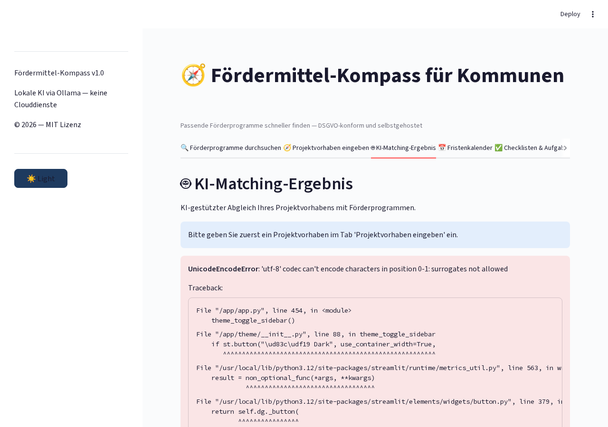
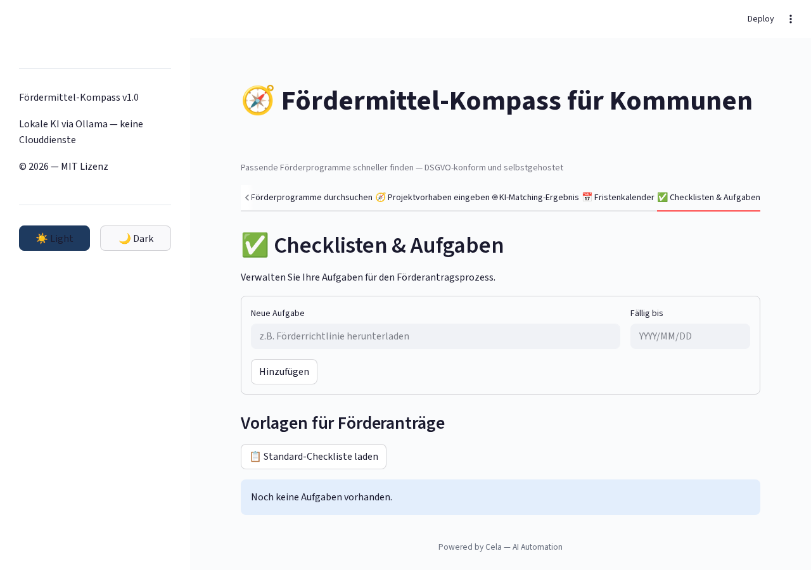

# Foerdermittel Kompass

<p align="center">
</p>

    

> Fördermittel-Kompass für Kommunen — passende Programme schneller finden

## Overview

KI-gestützte Fördermittelsuche für Kommunen. Matching von Projekten mit passenden Förderprogrammen, Deadline-Tracking und Checklisten. Self-hosted mit Ollama, DSGVO-konform.

## Features

- KI-gestütztes Matching von Projekten und Förderprogrammen
- Deadline-Tracking mit Erinnerungen
- Checklisten für Anträge
- Programm-Datenbank
- Kommunale Profil-Verwaltung
- Smart-City und Nachhaltigkeits-Fokus

## Tech Stack

| Tech | Zweck |
|------|-------|
| Python 3.11+ | Backend |
| Streamlit | Web-Interface |
| Ollama | Lokale KI |
| PostgreSQL | Datenbank |
| Docker | Deployment |

## Quick Start

```bash
pip install -r requirements.txt
streamlit run app.py
```

## Screenshots

**Projekt-Eingabe für Matching**



**Matching-Ergebnis mit Förderprogrammen**



**Förderprogramm-Suche**



**Antrags-Checkliste**



**Deadline-Kalender**


---

## Contributing

Beiträge sind willkommen! Bitte erstelle einen Issue oder Pull Request.

## License

MIT License — siehe [LICENSE](LICENSE).

<p align="center">
</p>